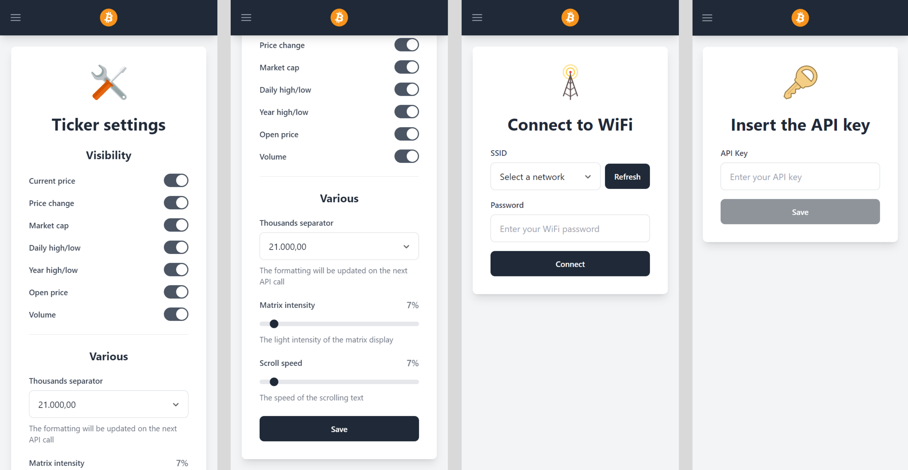

# LED Matrix Bitcoin Ticker with ESP8266

## Overview
This project transforms an ESP8266 microcontroller and a MAX7219 LED matrix into a dynamic Bitcoin ticker. It displays a set of up-to-date information about Bitcoin, such as the current price, daily change, yearly high, yearly low, opening price, and much more, providing a unique and informative crypto display.

## The Web Page
Control the settings using the extremely user-friendly webpage!

## Features
- **Real-Time Bitcoin Information:** Displays a variety of helpful, up-to-date Bitcoin data, including the current price, daily change, yearly high, yearly low, opening price, and much more!
- **WiFi Connectivity:** Connects to the internet using WiFi to fetch real-time data.
- **Web Server for Configuration:** Features a web server with a simple web page for easy WiFi configuration.

## Hardware Requirements
- ESP8266 Microcontroller
- MAX7219 LED Matrix
- Power supply for the ESP8266
- Jumper wires for connecting the LED Matrix to the ESP

## Software Dependencies
- `PlatformIO` extension for Visual Studio Code (as the IDE)
- Libraries: `MD_Parola.h`, `MD_MAX72xx.h`, `ESP8266WiFi.h`, `ESP8266HTTPClient.h`, `ArduinoJson.h`, `WiFiClientSecure.h`, `LittleFS.h`, `ESPAsyncWebServer.h`, `EEPROM.h`, `StreamUtils.h`

## Configuration and Usage
1. Connect the LED Matrix to the ESP8266 using jumper wires.
2. Download the source code from the repository.
3. Verify that the pinout of the LED Matrix is correct; adjust the values to match your configuration if necessary.
4. Connect the ESP to your computer via USB.
5. Use **PlatformIO** to write the `data` folder onto the flash memory of the ESP8266 (`Build Filesystem Image`, then `Upload Filesystem Image`).
6. Use **PlatformIO** to upload the source code to the ESP.
7. After rebooting, a `Bitcoin-Ticker` WiFi access point should appear. Connect to it and enter `192.168.4.1` in your browser's URL bar.
8. Create a free account at [`financialmodelingprep.com`](https://site.financialmodelingprep.com) and enter the provided API key in the special section of the webpage.
9. If you want, you can also decide which information will be displayed on the matrix. Simply go to the `Values` section of the webpage and edit the settings.
10. Enter your WiFi credentials on the web page to connect the ESP to your WiFi network.
11. If a success message appears, your Bitcoin ticker is ready!
12. **Enjoy your ticker!** ❤️

## Customization Options
- **Number of LED Modules:** Can be adjusted based on your setup.
- **Pinout Configuration:** Modify CLK, DATA, and CS pins as needed.
- **Scroll Speed:** Customize the scroll delay for the LED Matrix.

For advanced setup and customization instructions, refer to the comments within the `main.cpp` file.

## Special Thanks
Special thanks to all these amazing people and their contributions: ❤️
- [`RobTillaart`](https://github.com/RobTillaart) for the inspiration of the currency formatter function in his [`currency`](https://github.com/RobTillaart/Currency) library.
- [`MajicDesigns`](https://github.com/MajicDesigns) for the [`MD_Parola`](https://github.com/MajicDesigns/MD_Parola) and [`MD_MAX72XX`](https://github.com/MajicDesigns/MD_MAX72XX) libraries.
- [`esp8266`](https://github.com/esp8266) for the `ESP8266WiFi`, `ESP8266HTTPClient`, `WiFiClientSecure`, and `LittleFS` libraries ([repository](https://github.com/esp8266/Arduino)).
- [`bblanchon`](https://github.com/bblanchon) for the [`ArduinoJson`](https://github.com/bblanchon/ArduinoJson) and [`StreamUtils`](https://github.com/bblanchon/ArduinoStreamUtils) libraries.
- [`me-no-dev`](https://github.com/me-no-dev) for the [`ESPAsyncWebServer`](https://github.com/me-no-dev/ESPAsyncWebServer) library.

## Author
Mauro Brambilla - brumaombra

## License
This project is licensed under the MIT License - see the LICENSE file for details.
